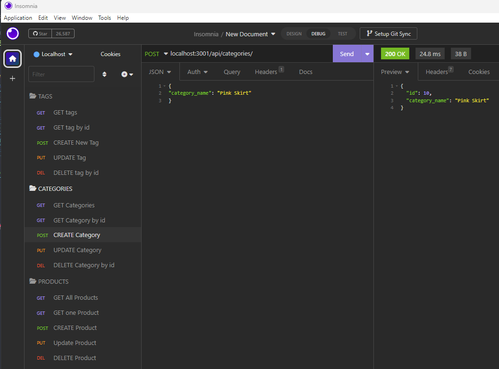

# 🛍️ E-Commerce Back End 
<br>

## Table of contents
- [Description](#description-📝)
- [Overview](#overview-📁)
  - [User experience](#user-experience-👤)
  - [Screenshot](#screenshot-📸)
  - [Links](#links-🔗)
- [My process](#my-process-💡)
  - [Built with](#built-with-🔨)
  - [Useful resources](#useful-resources-📚)
- [Author](#author-✏️)

<br>
<br>

#  Description 📝

- A back end for an e-commerce site utilizing Express.js API to use Sequelize to interact with a MySQL database.

<br>

# Overview 📁 


## The Challenge

<br>

### User Story

```md
AS A manager at an internet retail company
I WANT a back end for my e-commerce website that uses the latest technologies
SO THAT my company can compete with other e-commerce companies
```

### Acceptance Criteria

```md
GIVEN a functional Express.js API
WHEN I add my database name, MySQL username, and MySQL password to an environment variable file
THEN I am able to connect to a database using Sequelize
WHEN I enter schema and seed commands
THEN a development database is created and is seeded with test data
WHEN I enter the command to invoke the application
THEN my server is started and the Sequelize models are synced to the MySQL database
WHEN I open API GET routes in Insomnia for categories, products, or tags
THEN the data for each of these routes is displayed in a formatted JSON
WHEN I test API POST, PUT, and DELETE routes in Insomnia
THEN I am able to successfully create, update, and delete data in my database
```

## User Experience 👤 

<br> 

> <em> Please Note: Node.js, Insomnia & MySQL need to be installed on your computer for this application.</em>

<br> 

1.  Clone the repository using:

```terminal
git clone https://github.com/AveryCaldwell/e-commerce-Back-End-ORM.git
```
2.  Navigate to the folder using the terminal.

3. Use the [MySQL2](https://www.npmjs.com/package/mysql2) and [Sequelize](https://www.npmjs.com/package/sequelize) packages to connect your Express.js API to a MySQL database and the [dotenv](https://www.npmjs.com/package/dotenv) package to use environment variables to store sensitive data.

3. Install dependencies using:
```terminal
npm install
```
4. Log in to your MySQL using:
```terminal
mysql -u root -p
```
5. Create the database:
 ```terminal
source db/schema.sql
```
6. After creating the models and routes, run the following command to seed data to your database:
 ```terminal
 npm run seed
```
7. Start the application:
```terminal
npm start
```
8. Open Insomnia to GET, POST, PUT, and DELETE the routes for categories, products, or tags.

<br>

___

<br>

## Screenshot 📸
​<br>


​
​<br>

###  Links 🔗
- Live URL: [https://watch.screencastify.com/v/TdLJXDVYKnwGBGIURgHI](https://watch.screencastify.com/v/TdLJXDVYKnwGBGIURgHI)
- Github Repository: [https://github.com/AveryCaldwell/e-commerce-Back-End-ORM](https://github.com/AveryCaldwell/e-commerce-Back-End-ORM)


<br>
<hr>
<br>


##  My process 💡

###  Built with 🔨

- JavaScript
- MySQL
- Express
- Insomnia
- GitHub
- ORM
- MySQL Workbench

<br>

###  Useful resources 📚

- Emojis:   [https://github.com/ikatyang/emoji-cheat-sheet#office](https://github.com/ikatyang/emoji-cheat-sheet#office)
- MySQL2:   [https://www.npmjs.com/package/mysql2](https://www.npmjs.com/package/mysql2)
- Sequalize:    [https://www.npmjs.com/package/sequelize](https://www.npmjs.com/package/sequelize)
- dotenv:   [https://www.npmjs.com/package/dotenv](https://www.npmjs.com/package/dotenv)

<br>
<hr>
<br>

## Author ✏️
  Avery Caldwell
  - Email: [AveryCaldwell7@gmail.com](AveryCaldwell7@gmail.com)
  - LinkedIn: [https://www.linkedin.com/in/averycaldwell/](https://www.linkedin.com/in/averycaldwell/)
  - GitHub: [AveryCaldwell](https://github.com/AveryCaldwell)